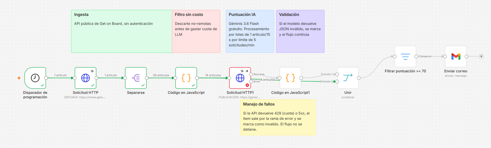
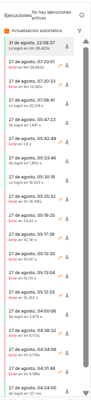

# n8n Workflows

Production-minded n8n automations I've built. Exports retain credential references (internal n8n IDs) but contain no tokens, keys or secrets.

## radar-vacantes

A daily job radar. Pulls remote job postings from the Get on Board public API, scores each one against my profile with an LLM, and emails me only the matches above threshold.

### Why it exists

I was reading job boards manually every morning, most listings ruled out by country or seniority before I finished the first paragraph. This does the triage.

### Flow

Schedule (7am) → fetch 30 postings → split → free pre-filter → LLM scoring → output validation → merge → threshold filter → email

### Engineering decisions

**Free pre-filter before the LLM.** The API returns `remote` and `countries` as structured fields, so non-remote and country-restricted postings are dropped in a Code node before any model call. On a typical run this cuts 30 postings to 14 — roughly half the LLM quota saved at zero cost.

**Model choice: Gemini 3.6 Flash, free tier.** Scoring a posting against a fixed profile is a classification task; it does not need frontier capability. The LLM call is isolated in a single HTTP node and can be swapped for Claude or GPT by changing the endpoint and request body. Marginal cost at this volume: zero.

**Rate limiting is a design constraint, not an afterthought.** The free tier allows 5 requests per minute. Batching is set to 1 item every 15 seconds — 4/min, deliberately under the ceiling. I found this the hard way by exhausting the daily quota during development.

**Output validation.** LLMs return malformed JSON sometimes. The validation node parses the response, range-checks the score, and on failure returns a flagged record instead of throwing. A bad model response degrades one item; it does not kill the run.

**Error branch.** The LLM node uses `continueErrorOutput`. A 429 or 5xx routes the item down the error branch into the same validation node, where it lands as invalid. The workflow completes.

**Merge by key, not by position.** The scored records and the original posting data are rejoined on the posting `id`. Combining by position looked fine in testing but silently misaligns the moment one item fails — you'd get one posting's score attached to another posting's title.

### Running it

Import `workflows/radar-vacantes.json` into n8n. You'll need to add your own credentials:

- Google Gemini (PaLM) API — free tier from Google AI Studio
- Gmail OAuth2 — for the notification node

Adjust the profile text in the LLM node's request body to match your own background, and the threshold in the filter node.

### Status

Built and validated end to end.

## agente-leads-telegram

A conversational lead-qualification agent on Telegram. It talks to inbound prospects in Colombian Spanish, extracts four qualification fields across a multi-turn conversation, and flags the lead once all four are known.

### Why it exists

Service contractors lose leads to response time. An inbound message at 9pm sits unanswered until morning, by which point the prospect has called someone else. This agent responds immediately and does the qualification work before a human is involved.

### Flow

Telegram trigger → normalize message → AI Agent (Gemini 3.6 Flash + conversation memory) → output validation → reply

### Engineering decisions

**AI Agent over a raw HTTP call.** The first version called the model directly over HTTP. It worked, but it was stateless — every message was treated as the first, so the agent could never accumulate the four fields. Switching to n8n's AI Agent node with an attached memory sub-node was a core redesign, not a patch.

**Instructions in the system message, not the prompt.** With memory attached, anything passed as the user prompt is stored in conversation history. Full instructions in the prompt meant the 10-message window filled with copies of the instruction set instead of the actual conversation — degrading exactly when more context was needed, and paying for those tokens every turn.

**Output validation.** The agent is instructed to return structured JSON. The validation node parses it and, on failure, returns a graceful apology message rather than throwing. The conversation survives a malformed response.

**Error branch.** The agent node uses `continueErrorOutput`. Both outputs route to the same validation node, so a 503 from the model provider still produces a reply to the customer instead of silence.

### Known limitation: memory concurrency

Simple Memory has no locking. Under concurrent execution — two Telegram messages arriving before the first finishes its 5-20s model call — both executions read the same memory snapshot and write over each other. The result is a corrupted transcript with duplicated and out-of-order turns, and an agent that re-asks questions it already has answers to.

I found this by instrumenting the execution history: comparing `update_id` and `message_id` across paired executions showed distinct messages running in the same second, and the stored transcript contained interleaved fragments of four separate conversations.

The fix is external memory — Postgres or Redis chat memory — which also solves persistence, since Simple Memory does not survive an instance restart. Not implemented here; documented as the known boundary of this build.

### Running it

Import `workflows/agente-leads-telegram.json`. Requires your own credentials:

- Telegram Bot API token (from @BotFather)
- Google Gemini (PaLM) API — free tier

Adjust the system message for your vertical and the qualification fields you need.

### Status

Working end to end in single-message-at-a-time conversation. Degrades under concurrent messages, as documented above.
